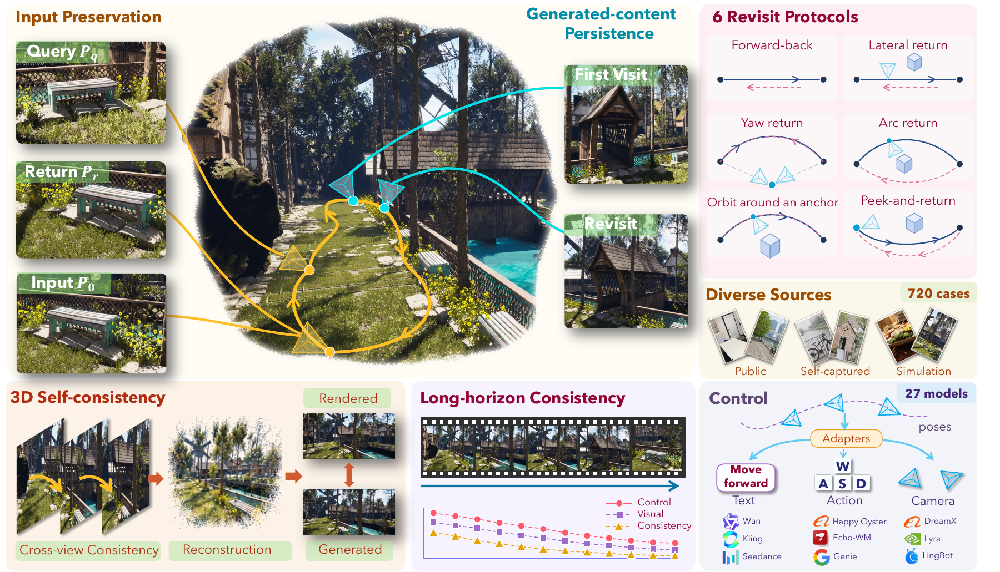
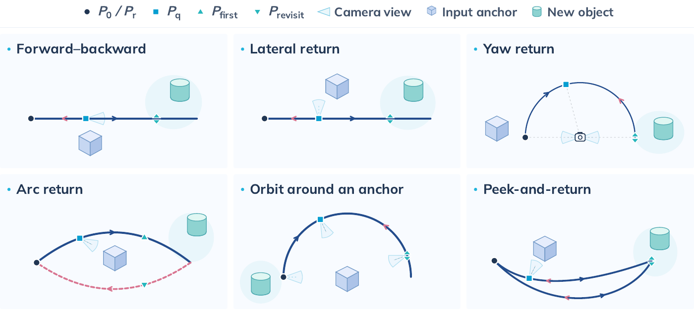
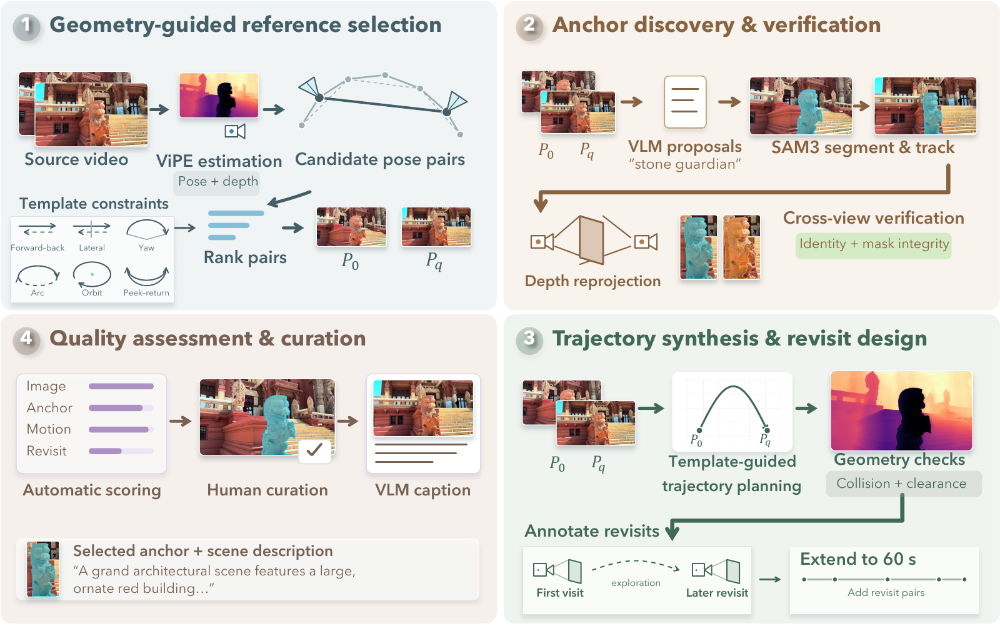

<div align="center">

# Orbia: Do Generated Videos Form a Consistent 3D World?

[](https://orbia-bench.github.io/paper/orbia.pdf)
[](https://orbia-bench.github.io/)
[](https://huggingface.co/datasets/Orbia/Orbia)
[](LICENSE)

</div>



**ORBIA** is a benchmark for the 3D consistency of interactive video world models. Given an input image, a scene caption and a camera trajectory, a world model should not only produce good-looking video that follows the controls, but also keep the scene it was given, remember the content it generated, and produce views that form one consistent 3D world. ORBIA evaluates these properties with registered RGB-D references, annotated anchors and controlled revisits.

## Highlights

- **Three dimensions of 3D consistency.** We separate *input preservation* (does the model keep the scene and landmarks in the input image?), *generated-content persistence* (does newly generated content stay the same when the camera comes back?) and *3D self-consistency* (do the generated views agree in geometry and support a shared 3D reconstruction?).
- **Exploration-and-revisit trajectories.** Six trajectory templates (forward–backward, lateral, yaw, arc, orbit, peek) move the camera away from the input view, revisit regions outside it, and return to the start. Each case comes in a 22-second version and a minute-long version with three revisits.
- **Reference-grounded evaluation.** Every case has registered RGB-D views at the input and query poses and verified *anchors*, i.e. distinctive static objects, so preservation is measured against real references and per landmark rather than by a single image-level score.
- **Diverse, curated data.** 720 cases from ScanNet++, SpatialVID, Sekai, MiraData, our own recordings and 48 Unreal Engine environments, selected from over 110,000 source samples with over 300 hours of annotation and review.
- **Works with any world model.** Adapters for camera-conditioned, action-conditioned and image+text-to-video models. We evaluate 27 models.

This repository contains the evaluation code, the model adapters, and the data construction pipelines for real videos and Unreal Engine.

## Evaluation Dimensions

| Tier | Dimension | Metrics | Weight |
| --- | --- | --- | ---: |
| T1 | Control Alignment | Translation/rotation error, Move/Look accuracy | 25% |
| T2 | Visual Quality | LAION aesthetic, MUSIQ, flicker, AMT smoothness, HPSv3 | 25% |
| **T3** | **Input Preservation** | Scene/anchor PSNR, SSIM, LPIPS, DINO and depth AbsRel at return and query; anchor identity | 10% |
| **T4** | **Generated-Content Persistence** | Revisit appearance and depth, reprojected DINO, surface F-score | 10% |
| **T5** | **3D Self-Consistency** | Cross-view depth and DINO consistency, regional scale, Gaussian reconstruction on held-out views | 10% |
| T6 | Temporal Stability | Quality, control and local geometry over 5-second windows | 20% |

Cameras and depth of the generated video are recovered with Depth Anything 3. T3 compares the return and query views with the registered references on input-visible surfaces, and tracks each anchor with SAM 3.1. T4 compares each revisit with the first visit on surfaces seen by both. T5 checks cross-view agreement and renders held-out views from a Gaussian scene built on the generated frames. T6 measures how quality, control and geometry hold up over time, with long videos weighted 70%.

## Dataset

Each trajectory starts at **P0**, passes the query view **Pq**, visits a region outside the input view (**P_first**), explores elsewhere, revisits it (**P_revisit**), and returns to **P0**.



| Source | Type | Short | Long | Reference geometry |
| --- | --- | ---: | ---: | --- |
| ScanNet++ | Real, indoor | 60 | – | Sensor depth + laser-scan mesh |
| SpatialVID | Real | 134 | 74 | Estimated cameras and depth |
| Sekai | Real | 25 | 25 | Estimated cameras and depth |
| MiraData | Real | 21 | 21 | Estimated cameras and depth |
| Self-recorded | Real | 60 | 30 | Estimated cameras and depth |
| Unreal Engine | Simulated | 180 | 90 | Rendered depth, poses, instance IDs |
| **Total** | | **480** | **240** | |

Short cases have 357 frames (22 s) and long cases 961 frames (60 s), at 1280×720 with trajectories sampled at 16 FPS.

## Leaderboard

**Submit your model:** generate videos for all 720 cases and email them to dongyue.lu@u.nus.edu and guianfang@u.nus.edu, with or without your own evaluation results. See the [submission guide](docs/submission.md).

Scores of the 27 models evaluated in the paper, sorted by Overall (25% Control, 25% Quality, 10% each for Input Preservation, Persistence and 3D Consistency, 20% Stability). Best per column in bold.

| # | Model | Type | Overall | Control | Quality | Input Pres. | Persistence | 3D Consist. | Stability |
| ---: | --- | --- | ---: | ---: | ---: | ---: | ---: | ---: | ---: |
| 1 | SolarWM-H3 | Camera | **76.32** | 79.93 | 74.76 | 69.26 | **70.28** | 68.84 | **84.05** |
| 2 | Lyra2 | Camera | 74.77 | **81.64** | 71.37 | 68.79 | 70.25 | 61.51 | 82.31 |
| 3 | EVOKE | Camera | 72.70 | 66.47 | 76.48 | 68.81 | 66.43 | 68.02 | 83.18 |
| 4 | Echo-WM | Camera | 72.24 | 70.74 | 75.02 | 65.91 | 61.42 | 65.26 | 82.69 |
| 5 | Gen3C | Camera | 71.95 | 75.51 | 67.55 | **75.23** | 68.58 | 60.16 | 78.96 |
| 6 | Matrix game 3.5 | Camera | 68.07 | 64.18 | 74.03 | 66.93 | 60.82 | 54.61 | 76.41 |
| 7 | Seedance2.5 | Image+Text | 67.44 | 43.23 | 76.97 | 72.84 | 67.70 | 72.54 | 80.39 |
| 8 | AlayaWorld | Camera | 67.01 | 61.68 | 71.04 | 70.17 | 56.62 | 58.92 | 76.31 |
| 9 | Genie3 | Action | 66.72 | 55.26 | 74.43 | 61.01 | 54.41 | 61.25 | 83.15 |
| 10 | LingBot-World v2 | Camera | 65.98 | 58.48 | 75.34 | 61.54 | 52.00 | 57.11 | 77.28 |
| 11 | HY-WorldPlay | Camera | 65.50 | 45.26 | 72.06 | 66.84 | 69.84 | 70.34 | 77.32 |
| 12 | Kling3.0 | Image+Text | 65.23 | 38.58 | 77.38 | 69.14 | 63.32 | 71.30 | 79.30 |
| 13 | SANA-WM | Camera | 65.08 | 59.39 | 73.22 | 63.19 | 51.95 | 54.10 | 75.03 |
| 14 | HappyOyster | Action | 64.34 | 60.49 | 68.78 | 58.23 | 46.31 | 59.17 | 78.25 |
| 15 | Cosmos3-Super | Image+Text | 63.72 | 27.92 | **79.04** | 66.04 | 69.75 | **74.55** | 79.73 |
| 16 | HunyuanVideo1.5 | Image+Text | 63.27 | 36.09 | 77.07 | 63.12 | 57.44 | 71.31 | 78.96 |
| 17 | Cosmos3-Nano | Camera | 62.75 | 35.70 | 74.25 | 66.78 | 66.29 | 70.10 | 74.71 |
| 18 | LingBot-World v1 | Camera | 62.73 | 49.12 | 73.84 | 59.56 | 50.71 | 58.93 | 75.37 |
| 19 | Voyager | Camera | 62.72 | 60.92 | 68.05 | 58.65 | 43.72 | 46.32 | 78.04 |
| 20 | MiniMax-H3 | Image+Text | 62.00 | 32.48 | 78.09 | 63.36 | 55.79 | 69.42 | 77.51 |
| 21 | DreamX-World | Camera | 61.79 | 48.99 | 74.96 | 60.96 | 48.70 | 48.73 | 74.82 |
| 22 | LTX2.5 | Image+Text | 61.25 | 26.51 | 77.96 | 64.81 | 60.25 | 71.64 | 77.30 |
| 23 | FantasyWorld | Camera | 60.64 | 39.16 | 70.70 | 63.08 | 60.17 | 63.53 | 72.51 |
| 24 | Wan2.7 | Image+Text | 60.55 | 31.31 | 76.46 | 65.96 | 54.35 | 64.19 | 75.79 |
| 25 | ABot-World | Action | 58.87 | 47.06 | 66.97 | 57.47 | 45.22 | 48.32 | 76.32 |
| 26 | LongCat | Image+Text | 57.18 | 23.76 | 77.30 | 58.89 | 47.77 | 64.11 | 74.22 |
| 27 | Astra | Camera | 52.30 | 28.45 | 61.30 | 59.38 | 44.74 | 59.91 | 67.31 |

Type: Camera = camera-conditioned, Action = action-conditioned, Image+Text = image+text-to-video. 

## Installation

```bash
bash tools/install_evaluation.sh
conda activate orbia-eval
python tools/download_weights.py --workflow evaluation
```

The install script needs Conda, FFmpeg and CUDA 12.8. See [docs/installation.md](docs/installation.md) for details.

## Download the Dataset

```bash
hf download Orbia/Orbia --repo-type dataset --local-dir data/download
python tools/extract_dataset.py --archives data/download --output data/orbia
```


## Run Your Model

Use this section to run your own model on the ORBIA data and produce the videos for [Evaluation](#evaluation).

```bash
pip install -r requirements/models.txt
```

Each case provides an input image, a scene caption and a camera trajectory. `src.models` converts the trajectory into the control your model takes:

- **Camera-conditioned**: camera poses and intrinsics, with helpers for coordinate conventions and resizing. Long trajectories are split into windows automatically.
- **Action-conditioned**: `W A S D` (move) and `I J K L` (look) keys, per generation block or as timed key presses.
- **Image+text-to-video**: a timed motion description appended to the caption, e.g. "move forward for 3 seconds, then turn left by 60 degrees".

Copy a template and fill in your model call:

| Model type | Template | Method to implement |
| --- | --- | --- |
| Camera-conditioned | [examples/camera_model.py](examples/camera_model.py) | `generate_with_poses` |
| Action-conditioned | [examples/action_model.py](examples/action_model.py) | `generate_with_actions` |
| Image+text-to-video | [examples/text_model.py](examples/text_model.py) | `generate_segment` |

Then generate and evaluate:

```bash
python generate.py --model examples.camera_model:MyCameraModel \
  --dataset data/orbia --output videos/my-model
python evaluate.py --videos videos/my-model/videos.jsonl
```

See [docs/models.md](docs/models.md) for details.

## Evaluation

Use this section if you already have generated videos for the ORBIA cases. To generate them with your model first, see [Run Your Model](#run-your-model).

**1. Prepare videos.** Put one video per case in a folder and name it after the case ID. Short cases need 357 frames and long cases 961 frames, where frame *i* follows the *i*-th requested camera pose. We recommend saving at 16 FPS, the timeline of the trajectories; any resolution works.

```text
videos/my-model/
├── case_0001.mp4
├── case_0002.mp4
└── ...
```

**2. Run evaluation.**

```bash
# all tiers
python evaluate.py --videos videos/my-model

# selected tiers, multiple GPUs
python evaluate.py --videos videos/my-model --tiers T3 T4 --devices 0,1,2,3
```

For each video, the evaluator recovers cameras and depth with DA3 (DA3 Streaming for long videos), computes the per-case metrics, and then normalizes and averages them into tier scores. For action-conditioned models add `--control-profile action_only`; for image+text-to-video models add `--group ti2v`.

**3. Read the results.** Tier scores, Overall and ranks are written to `results/scores/scores.csv`, and per-case measurements to `results/<model>/results/<case_id>/report.json`. Rerunning the command resumes unfinished cases.

See [docs/evaluation.md](docs/evaluation.md) for all options and the scoring details.

## Data Construction



Each case pairs two registered RGB-D views (input and query) with a synthesized trajectory that passes through both and returns to the start. The pipeline has four steps:

1. **Select reference views.** Read or estimate cameras and depth, then choose input/query pairs whose relative motion fits a trajectory template.
2. **Discover and verify anchors.** Qwen3.5 proposes static, distinctive landmarks; SAM 3.1 segments them in both views; masks are filtered by area and connectivity; tracking checks that both masks show the same object; back-projection with depth finds the anchor surfaces visible in both views.
3. **Synthesize trajectories and revisits.** Fit the template through the two views, check camera clearance against the scene geometry, select revisits to regions outside the input view, and extend the case to one minute with three revisits.
4. **Rank and review.** Rank candidates by image sharpness, anchor quality, trajectory quality and revisit quality, filter scenes with a VLM review, inspect the remaining cases in a browser, and export the accepted ones with a VLM-written scene caption.

The sources differ in how geometry and anchors are obtained:

| Source | Geometry | Anchors |
| --- | --- | --- |
| SpatialVID | Released cameras and depth | Qwen3.5 + SAM 3.1 + tracking |
| Sekai, MiraData | Estimated from the video with DA3 or ViPE | Qwen3.5 + SAM 3.1 + tracking |
| Self-recorded | Estimated from the video with DA3 or ViPE | Chosen during recording, segmented with SAM 3.1 |
| ScanNet++ | Sensor depth and COLMAP cameras | Rendered from the semantic mesh |
| Unreal Engine | Rendered depth and cameras | Selected scene actors, masks from object IDs |

```bash
# real videos
python tools/build_dataset.py --config configs/construction/spatialvid.local.json --stage geometry
# ... candidates, annotate, review, export

# Unreal Engine
python tools/build_ue.py plan --config configs/ue.json
# ... render in Unreal Editor, then extract and convert
```

See [construction/README.md](construction/README.md) and [unreal/README.md](unreal/README.md) for the full steps. Both pipelines output the released dataset format ([docs/data.md](docs/data.md)).

## Repository Structure

```text
orbia/
├── evaluate.py            # evaluate generated videos
├── generate.py            # run a model on ORBIA cases
├── src/
│   ├── metrics/           # T1–T6 metrics and scoring
│   ├── backends/          # DA3, SAM 3.1 and per-GPU evaluation workers
│   ├── models/            # adapters for camera / action / image+text models
│   ├── data/              # dataset loading and packaging
│   ├── construction/      # real-video construction: sources, anchors, revisits, ranking
│   ├── trajectory/        # six trajectory templates and minute-long extensions
│   ├── ue/                # Unreal Engine planning, extraction and export
│   └── utils/             # camera models and geometry
├── examples/              # model adapter templates
├── tools/                 # installation, weights, dataset, construction and submission tools
├── unreal/                # scripts run inside Unreal Editor
├── configs/               # evaluation and construction configs
├── skills/                # agent skills
└── docs/
```

## Agent Skills

The [skills/](skills/) folder has three skills for coding agents such as Claude Code or Codex, covering the common workflows:

| Skill | Use it to |
| --- | --- |
| [orbia-generation](skills/orbia-generation/SKILL.md) | Wrap your model and generate videos for all cases |
| [orbia-evaluation](skills/orbia-evaluation/SKILL.md) | Evaluate videos and read the scores |
| [orbia-submission](skills/orbia-submission/SKILL.md) | Prepare, check and send a leaderboard submission |

For Claude Code, copy them into your project with `mkdir -p .claude/skills && cp -r skills/* .claude/skills/`, then ask e.g. "run my model on ORBIA". Other agents can read the `SKILL.md` files directly.

## Acknowledgements

ORBIA builds on [SpatialVID](https://github.com/NJU-3DV/SpatialVID), [Sekai](https://github.com/Lixsp11/sekai-codebase), [MiraData](https://github.com/mira-space/MiraData), [ScanNet++](https://github.com/scannetpp/scannetpp), [ViPE](https://github.com/nv-tlabs/vipe), [Depth Anything 3](https://github.com/ByteDance-Seed/Depth-Anything-3), [SAM 3](https://github.com/facebookresearch/sam3), [Qwen3.5](https://github.com/QwenLM/Qwen3.5), [DINOv2](https://github.com/facebookresearch/dinov2), [VBench](https://github.com/Vchitect/VBench), [WBench](https://github.com/meituan-longcat/WBench), [AMT](https://github.com/MCG-NKU/AMT), [HPSv3](https://github.com/MizzenAI/HPSv3), [LPIPS](https://github.com/richzhang/PerceptualSimilarity), [gsplat](https://github.com/nerfstudio-project/gsplat) and [Open3D](https://github.com/isl-org/Open3D). We thank the authors for releasing their code and data.

## Citation

```bibtex
@article{lu2026orbia,
  title   = {Orbia: Do Generated Videos Form a Consistent 3D World?},
  author  = {Dongyue Lu and Guian Fang and Hur Lim and Yonggang Wu and Yanrong Wang and Hongshan Chen and Shengju Qian and Yue Liao and Wei Chow and Lingdong Kong and Tianxin Huang and Yu Yang and Hongji Yang and Junchao Huang and Alan Liang and Yihao Wang and Zihan Wang and Rong Li and Hanlin Chen and Xin Wang and Wei Tsang Ooi and Mike Zheng Shou and Shuicheng Yan},
  journal = {arXiv preprint},
  year    = {2026}
}
```

## License

The code is released under [Apache-2.0](LICENSE). The [dataset](https://huggingface.co/datasets/Orbia/Orbia) is released under CC BY-NC-SA 4.0 for non-commercial research; data derived from SpatialVID, Sekai, MiraData and ScanNet++ also keeps the terms of its source. Third-party models follow their own licenses.
